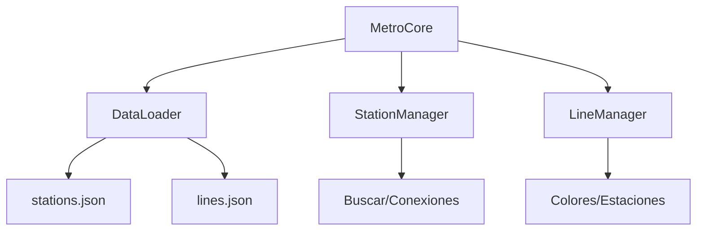

# **Documentación Completa de `modules/metro`**

## **Estructura del Directorio**

```bash

modules/

└── metro/

    ├── core/

    │   ├── MetroCore.js         # Clase principal

    │   ├── DataLoader.js        # Cargador de datos

    │   └── managers/

    │       ├── StationManager.js # Gestión de estaciones

    │       └── LineManager.js    # Gestión de líneas

    ├── config.js               # Configuración integrada

    └── utils/

        ├── normalization.js    # Normalización de texto

        └── timeCalculations.js # Cálculos horarios

```

---

## **1. MetroCore.js** *(Clase Principal)*

**Responsabilidades**:

- Inicialización del sistema

- Coordinación entre módulos

- Proporcionar API pública

### **Métodos Clave**

```javascript

class MetroCore {

  async initialize() {

    // 1. Carga datos con DataLoader

    // 2. Inicializa StationManager y LineManager

  }

  // API Pública

  get stations() {

    return {

      get(id),          // Obtener estación por ID

      search(query),    // Buscar estaciones

      connections(id)   // Conexiones de estación

    };

  }

  get lines() {

    return {

      get(id),          // Obtener línea por ID

      getAll()          // Listar todas las líneas

    };

  }

}

```

---

## **2. DataLoader.js** *(Carga de Datos)*

**Flujo de Trabajo**:

1. Lee archivos JSON de `/data/json`

2. Transforma a formato v3.0

3. Valida estructura

### **Ejemplo de Transformación**

```javascript

// Transforma datos crudos a formato estación

_transformStations(rawData) {

  return {

    id: rawData.id.toLowerCase(),

    name: rawData.nombre,

    line: rawData.linea,

    status: rawData.estado || "operational",

    details: {

      amenities: rawData.servicios.map(/*...*/)

    }

  };

}

```

---

## **3. StationManager.js**

**Funcionalidades**:

- Búsqueda de estaciones

- Gestión de conexiones

- Filtrado por estado

### **Métodos Principales**

```javascript

class StationManager {

  get(id) {

    // Devuelve estación con ID normalizado (minúsculas)

  }

  search(query, options = {}) {

    // Búsqueda por nombre/código con:

    // - Normalización de texto

    // - Filtro por línea (opcional)

  }

  getConnections(stationId) {

    // Ejemplo: { l1: true, l4a: false }

  }

}

```

---

## **4. LineManager.js**

**Gestión de Líneas**:

```javascript

class LineManager {

  constructor(linesData) {

    this.lines = this._indexLines(linesData);

  }

  _indexLines(data) {

    // Crea estructura { l1: {...}, l2: {...} }

  }

  addStation(lineId, stationId) {

    // Añade estación a línea

  }

  getColor(lineId) {

    // Obtiene color desde metroConfig

  }

}

```

---

## **5. config.js** *(Integración de Configuración)*

**Puente entre configs globales y Metro**:

```javascript

const globalConfig = require('../../config');

module.exports = {

  get lineColors() {

    return globalConfig.metro.styles.lineColors;

  },

  get schedule() {

    return globalConfig.chronos.schedule;

  }

};

```

---

## **6. Utils** *(Helpers Especializados)*

### **normalization.js**

```javascript

function normalize(text) {

  // Ejemplo: "Ñuñoa L3" → "nunoa l3"

  return text.normalize("NFD")

    .replace(/[\u0300-\u036f]/g, "")

    .toLowerCase();

}

```

### **timeCalculations.js**

```javascript

function isPeakHour(time, lineId) {

  // Usa config.chronos.schedule.peak

  // Considera festivos

}

```

---

## **Ejemplo de Uso Integrado**

```javascript

// Inicialización

const metro = new MetroCore();

await metro.initialize();

// Uso típico

const station = metro.stations.get("nunoa l3");

const line = metro.lines.get("l5");

console.log(`Estación: ${station.name}`);

console.log(`Color Línea: ${line.color}`);

```

---

## **Diagrama de Flujo**



📌 **Requisitos**:  

- Todos los archivos JSON deben usar **IDs en minúsculas**  

- Configuración debe cargarse antes de la inicialización