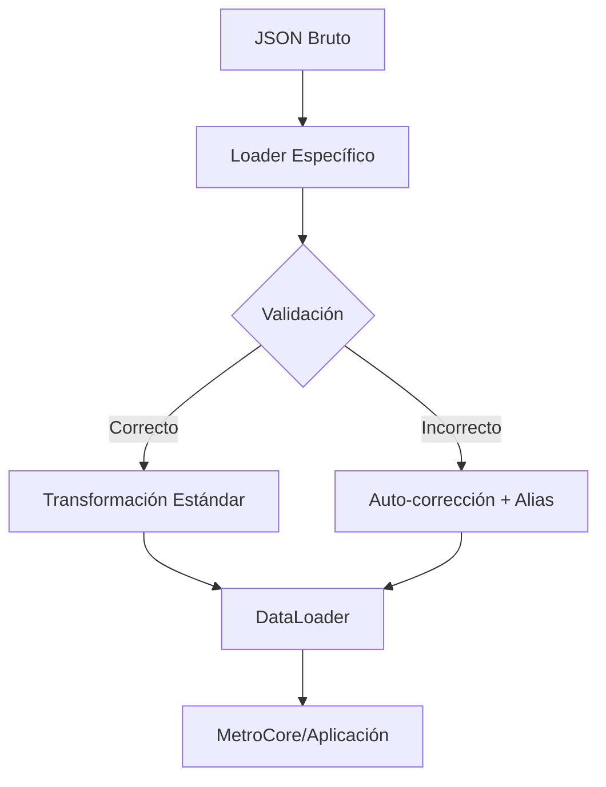
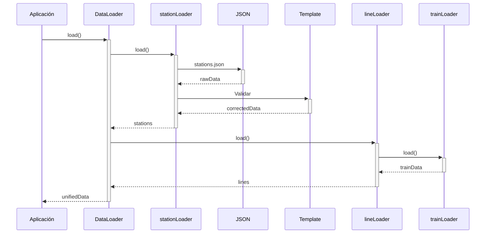

Aquí tienes la **guía completa** para obtener y trabajar con los datos del sistema de metro utilizando la arquitectura propuesta:

---

### **1. Estructura del Sistema**
```
src/
├── config/
│   ├── metroConfig.js   # Configuración operacional
│   └── styles.json     # Esquema de colores
└── modules/
    └── metro/
        ├── core/
        │   └── DataLoader.js  # Coordinador principal
        ├── data/
        │   ├── loaders/       # Cargadores especializados
        │   │   ├── lineLoader.js
        │   │   ├── stationLoader.js
        │   │   ├── ...
        │   └── json/          # Datos brutos
        │       ├── linesData.json
        │       ├── stations.json
        │       └── ...
        └── templates/
            └── estadoRedDetalle.php.json  # Plantilla maestra
```

---

### **2. Guía Paso a Paso**

#### **A. Cargar Datos Completos**
```javascript
const DataLoader = require('./modules/metro/core/DataLoader');

async function obtenerDatosCompletos() {
  try {
    const datos = await DataLoader.load();
    console.log(datos);
    /* Estructura:
    {
      system: { ... },       // Datos generales
      lines: { ... },        // Líneas y flota
      stations: { ... },     // Estaciones validadas
      intermodal: { ... },   // Conexiones
      trains: { ... },       // Trenes
      metadata: { version, sources }
    }
    */
  } catch (error) {
    console.error("Error al cargar datos:", error);
  }
}
```

#### **B. Acceder a Datos Específicos**

**Ejemplo 1: Obtener una estación con conexiones**
```javascript
function getEstacion(nombre) {
  const id = nombre.toLowerCase().replace(/\s+/g, '_');
  const estacion = datos.stations[id];
  
  return {
    ...estacion,
    linea: datos.lines[estacion.line],
    conexiones: {
      transporte: estacion.connections.transports,
      bicis: estacion.connections.bikes.length > 0
    }
  };
}
```

**Ejemplo 2: Listar trenes de una línea**
```javascript
function getFlota(lineaId) {
  return datos.lines[lineaId].fleet.map(tren => ({
    modelo: tren.id,
    velocidadMax: tren.specs.maxSpeed,
    imagen: tren.image
  }));
}
```

#### **C. Manejo de Errores y Datos Faltantes**
Los loaders automáticamente:
- Normalizan nombres (ej: "San Pablo L1" → "san_pablo")
- Añaden alias para variantes de nombres
- Usan valores por defecto para datos faltantes:
  ```javascript
  // Ejemplo en stationLoader.js
  status: data.status || 'operational',
  color: styles.lineColors[lineId] || '#CCCCCC'
  ```

---

### **3. Flujo de Transformación de Datos**


---

### **4. Ejemplos de Datos de Salida**

**Estación (stations.json → stationLoader.js):**
```javascript
{
  "san_pablo": {
    "id": "san_pablo",
    "line": "l1",
    "displayName": "San Pablo",
    "status": "operational",
    "aliases": ["San Pablo L1"],
    "connections": {
      "transports": ["Centropuerto"],
      "bikes": ["Línea Cero"]
    }
  }
}
```

**Línea (linesData.json → lineLoader.js):**
```javascript
{
  "l1": {
    "id": "l1",
    "displayName": "Línea 1",
    "color": "#EA2A0A",
    "fleet": [
      {
        "id": "NS-07",
        "specs": {
          "maxSpeed": "80 km/h",
          "capacity": 950
        }
      }
    ]
  }
}
```

---

### **5. Recomendaciones para Mantenimiento**

1. **Añadir Nuevas Estaciones**:
   - Editar `stations.json` y la plantilla `estadoRedDetalle.php.json` simultáneamente
   ```json
   // stations.json
   {
     "l1": {
       "Nueva Estación": {
         "status": "operational",
         "aliases": ["Nueva Estación L1"]
       }
     }
   }
   ```

2. **Actualizar Colores**:
   Modificar solo `styles.json`:
   ```json
   {
     "lineColors": {
       "l1": "#FF0000",
       "l2": "#00FF00"
     }
   }
   ```

3. **Depuración**:
   Verificar `metadata.sources` y warnings:
   ```javascript
   console.log(datos.metadata.sources.stations); 
   // "stations.json + stationConnections.json"
   ```

---

### **6. Casos de Uso Comunes**

**a. Encontrar estaciones con problemas:**
```javascript
const estacionesProblematicas = Object.values(datos.stations)
  .filter(s => s.status !== 'operational');
```

**b. Generar mapa de calor por afluencia:**
```javascript
const mapaCalor = Object.entries(datos.stations).map(([id, est]) => ({
  id,
  nombre: est.displayName,
  color: est.statusConfig.color
}));
```

**c. Integración con API externa:**
```javascript
async function actualizarEstadoTiempoReal() {
  const datos = await DataLoader.load();
  const estadoActual = await fetchAPI('/metro/status');
  
  return {
    ...datos,
    stations: Object.fromEntries(
      Object.entries(datos.stations).map(([id, est]) => [
        id,
        { ...est, status: estadoActual.estaciones[id] || est.status }
      ])
    )
  };
}
```

---

### **7. Diagrama de Secuencia**


Esta guía te permite:
1. Cargar datos consistentes
2. Manejar automáticamente variaciones en nombres
3. Acceder a información estandarizada
4. Extender fácilmente el sistema

¿Necesitas detalles adicionales sobre algún componente específico?