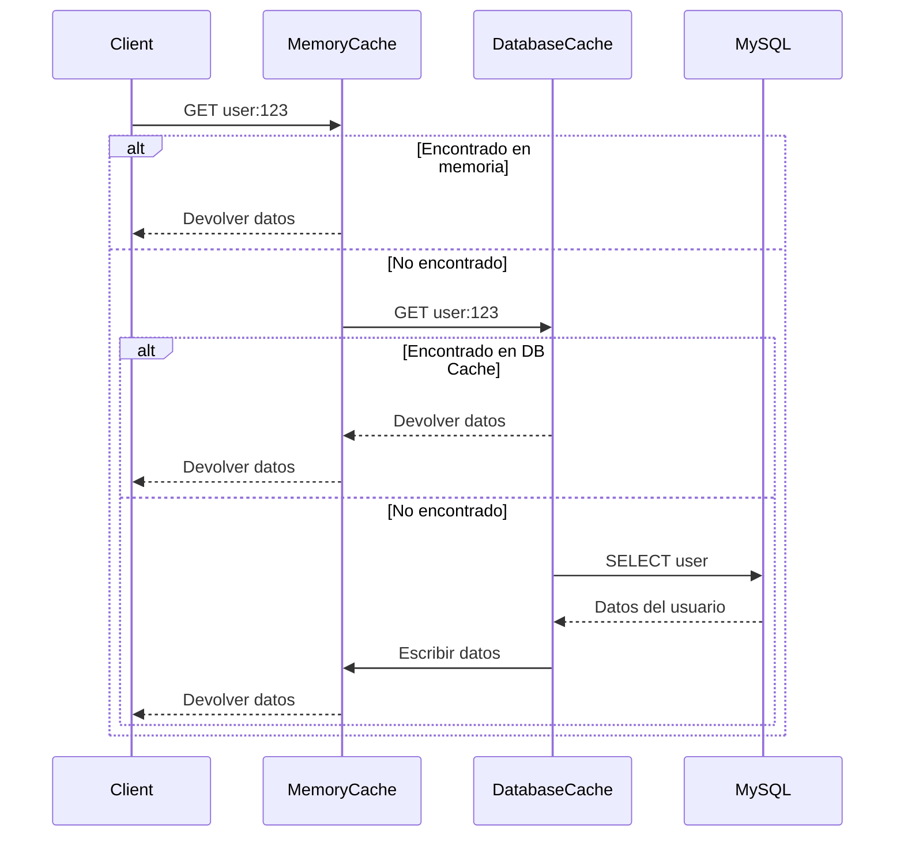

# **Documentación Completa del Sistema de Base de Datos y Caché**

## **📌 1. Visión General**
Sistema híbrido que combina:
- **Caché en memoria** (rápido)
- **Caché en base de datos** (persistente)
- **Gestión automática de TTL**
- **Estadísticas en tiempo real**

Perfecto para bots de Discord que necesitan:
✅ Alto rendimiento
✅ Persistencia de datos
✅ Escalabilidad

---

## **📂 2. Estructura de Archivos**
```
src/
├── core/
│   ├── database/
│   │   ├── DatabaseManager.js  # Conexión MySQL
│   │   └── models/
│   │       ├── CacheModel.js   # Operaciones de caché
│   │       ├── UserModel.js    # Modelo de usuarios
│   │       └── GuildModel.js   # Modelo de servidores
│   └── cache/
│       ├── CacheManager.js     # Sistema principal
│       └── adapters/
│           ├── MemoryCache.js  # Caché en RAM
│           └── DatabaseCache.js # Caché en MySQL
└── utils/
    └── logger.js              # Sistema de logging
```

---

## **🔧 3. Configuración Inicial**

### **Variables de Entorno (`.env`)**
```ini
# MySQL
DB_HOST=localhost
DB_USER=tu_usuario
DB_PASSWORD=tu_contraseña
DB_NAME=nombre_bd
DB_PORT=3306

# Caché
MEM_CACHE_SIZE=1000       # Máximo items en memoria
DEFAULT_CACHE_TTL=300000  # 5 minutos (en ms)
CACHE_GC_INTERVAL=60000   # Limpieza cada 1 minuto
```

### **Esquema de Base de Datos**
```sql
CREATE TABLE `cache` (
  `id` BIGINT UNSIGNED NOT NULL AUTO_INCREMENT,
  `namespace` VARCHAR(128) NOT NULL,
  `cache_key` VARCHAR(255) NOT NULL,
  `value` TEXT NOT NULL,
  `expires_at` DATETIME NOT NULL,
  `created_at` DATETIME NOT NULL DEFAULT CURRENT_TIMESTAMP,
  PRIMARY KEY (`id`),
  UNIQUE KEY `uq_namespace_key` (`namespace`, `cache_key`),
  KEY `idx_expires` (`expires_at`)
) ENGINE=InnoDB DEFAULT CHARSET=utf8mb4;
```

---

## **🚀 4. Uso Básico**

### **Inicialización**
```javascript
const db = require('./core/database/DatabaseManager');
const cache = require('./core/cache/CacheManager');
```

### **Ejemplos de Operaciones**

#### **Almacenar Datos**
```javascript
// Guardar en caché por 10 minutos
await cache.set(
    'user:preferences',
    'user123',
    { theme: 'dark', notifications: true },
    600_000 // TTL personalizado
);
```

#### **Recuperar Datos**
```javascript
const prefs = await cache.get('user:preferences', 'user123');
```

#### **Patrón Cache-Aside (Recomendado)**
```javascript
const userData = await cache.wrap(
    'user:data',          // Namespace
    'user789',            // Key
    async () => {         // Función de fallback
        return db.models.Users.findById('user789');
    },
    300_000               // TTL opcional
);
```

---

## **⚙️ 5. Funciones Avanzadas**

### **Transacciones SQL**
```javascript
await db.transaction(async (conn) => {
    await conn.query('UPDATE users SET balance = balance - ? WHERE id = ?', [100, 'user123']);
    await conn.query('INSERT INTO transactions VALUES (?, ?)', ['user123', -100]);
});
```

### **Estadísticas del Caché**
```javascript
console.log(cache.getStatistics());
/* Salida:
{
  hits: 15,
  misses: 3,
  writes: 8,
  layers: [
    { type: 'memory', size: 42, evictions: 2 },
    { type: 'database', queries: 20, errors: 0 }
  ]
}
*/
```

### **Limpieza Manual**
```javascript
// Limpiar entradas expiradas
await cache.cleanup();
```

---

## **📊 6. Diagrama de Flujo**



---

## **🚨 7. Manejo de Errores**

El sistema gestiona automáticamente:
- **Conexiones fallidas** a la base de datos
- **Serialización** de datos complejos (JSON)
- **TTL automático** para entradas expiradas

Ejemplo de error controlado:
```javascript
try {
    await cache.set('invalid', 'key', () => {}, 1000);
} catch (err) {
    console.error('Error controlado:', err.message);
}
```

---

## **🔒 8. Seguridad**

### **Buenas Prácticas**
1. **Nunca** almacenar datos sensibles sin cifrar
2. Usar namespaces específicos:
   ```javascript
   // Bien
   await cache.set('user:private:email', 'user123', 'email@dominio.com');

   // Mal (evitar)
   await cache.set('email', 'user123', 'email@dominio.com');
   ```
3. Validar siempre entradas:
   ```javascript
   function safeKey(key) {
       return key.replace(/[^\w:]/g, '');
   }
   ```

---

## **🧩 9. Extensibilidad**

### **Añadir Nuevos Adaptadores**
1. Crea un archivo en `/adapters/`:
   ```javascript
   class RedisCache {
       async get(namespace, key) { /* ... */ }
       async set(namespace, key, value, ttl) { /* ... */ }
   }
   module.exports = RedisCache;
   ```
2. Regístralo en `CacheManager.js`:
   ```javascript
   constructor() {
       this.layers = [
           new MemoryCache(/*...*/),
           new DatabaseCache(/*...*/),
           new RedisCache(/*...*/) // Nuevo adaptador
       ];
   }
   ```

---

## **📈 10. Rendimiento**

### **Optimizaciones Clave**
- **Memoria:** LRU cache con tamaño configurable
- **MySQL:** Índices optimizados para búsquedas
- **Conexiones:** Pooling eficiente

### **Métricas Típicas**
| Operación | Latencia (ms) |
|-----------|---------------|
| Memoria   | 0.1 - 2       |
| MySQL     | 2 - 10        |
| Redis*    | 1 - 5         |

*Requiere configuración adicional

---

## **🎯 11. Casos de Uso Comunes**

### **Para Bots de Discord**
```javascript
// Cachear información de servidor
const guildSettings = await cache.wrap(
    'guild:settings',
    interaction.guildId,
    () => db.models.Guilds.getSettings(interaction.guildId)
);

// Invalidar caché al actualizar
await db.models.Guilds.updateSettings(guildId, newSettings);
await cache.set('guild:settings', guildId, newSettings);
```

---

## **🔮 12. Roadmap Futuro**
1. **Soporte para Redis** como capa adicional
2. **Compresión** de valores grandes
3. **Replicación** entre nodos
4. **Dashboard** de monitoreo

---

Este sistema proporciona una solución **robusta, mantenible y de alto rendimiento** para manejar datos en tu bot de Discord. ¿Necesitas detalles adicionales sobre alguna sección específica?