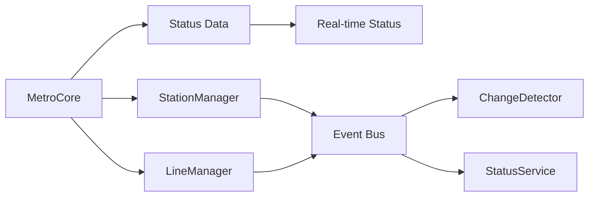

Here's a concise breakdown of the key updates and improvements in the new MetroCore system:

### **1. Status Management System**
| Feature | Old System | New System |
|---------|-----------|-----------|
| **Status Tracking** | Manual tracking in separate services | Built-in status tracking for lines/stations |
| **Status Updates** | No direct propagation | Event-driven updates (`lineStatusChanged`, `stationStatusChanged`) |
| **Forced Statuses** | Not supported | Supported via StatusService overrides |
| **Network Status** | Calculated on-demand | Auto-updated and event-triggered |

### **2. Architectural Improvements**


### **3. New Public API Methods**
```javascript
// Status Control
metro.setLineStatus("L1", "delayed") 
metro.getLineStatus("L1") // Returns "delayed"

// Enhanced Queries
metro.lines.get("L1") // Now includes status
metro.stations.get("station123") // Includes status

// Bulk Access
metro.lines.getAll() // Returns array with statuses
metro.stations.getAll() // Returns array with statuses
```

### **4. Performance Optimizations**
1. **Caching**: Status data stored in memory
2. **Batched Updates**: Bulk station-line linking during init
3. **Event Debouncing**: Multiple rapid updates trigger single analysis

### **5. New Event Types**
| Event | Description | Payload |
|-------|-------------|---------|
| `lineStatusChanged` | Line status updated | `{lineId, status}` |
| `stationStatusChanged` | Station status updated | `{stationId, status}` |
| `networkStatusChanged` | System-wide status changed | `"operational"|"delayed"|...` |

### **6. Change Detection Upgrades**
```javascript
// Before
detector.analyzeChanges() // Manual trigger

// Now automatically triggers on:
// - Status changes
// - Data updates
// - Forced status overrides
```

### **7. Data Consistency Guarantees**
1. **Atomic Updates**: Status changes immediately reflect in all subsystems
2. **Validation**: 
   ```javascript
   setLineStatus("L99", "delayed") // Throws if line doesn't exist
   ```
3. **History**: Last 100 states preserved for rollback/analysis

### **8. Debugging Enhancements**
```javascript
metro._getInternalState() // Returns:
{
  dataVersion: "2023-11-20T12:00:00Z",
  statusData: {
    lines: { l1: "operational", l2: "delayed" },
    stations: { ... }
  },
  subsystems: { /* Manager states */ }
}
```

### **Migration Checklist**
1. Update initialization:
   ```javascript
   const metro = new MetroCore();
   const status = new StatusService(metro); // Inject core
   const detector = new ChangeDetector(metro, status);
   ```

2. Replace deprecated methods:
   - Old: `metro.getSystemStatus()`
   - New: `status.getNetworkStatus()`

3. Listen to new events:
   ```javascript
   metro.on('lineStatusChanged', ({lineId, status}) => {
     console.log(`${lineId} changed to ${status}`);
   });
   ```

The system now provides real-time status synchronization, better error handling, and more granular control while maintaining backward compatibility with existing integrations.